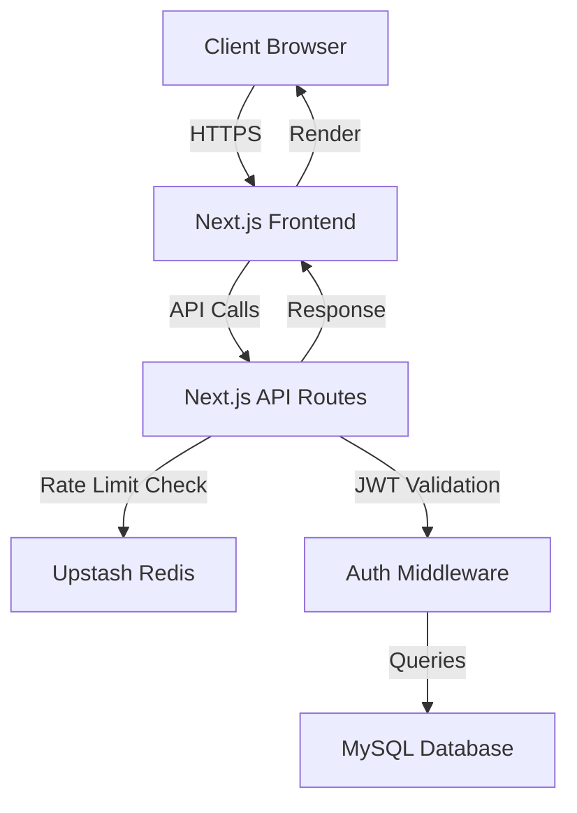

# 🏗 Architecture Technique - Fresh Dessert App

## 🎯 Vue d'ensemble

Application full-stack Next.js avec architecture moderne et sécurisée.

---

## 🔧 Stack Technique

### Frontend
- **Framework**: Next.js 16.1.1 (App Router)
- **React**: 19.2.3
- **TypeScript**: 5.x
- **Styling**: Tailwind CSS 4.x
- **UI Components**: shadcn/ui + Radix UI
- **State Management**: React Query (@tanstack/react-query)
- **Forms**: React Hook Form + Zod
- **Icons**: Lucide React

### Backend
- **API Routes**: Next.js API Routes (Node.js)
- **Database**: MySQL 8.0+ (mysql2/promise)
- **Authentication**: JWT + bcryptjs
- **Rate Limiting**: Upstash Redis
- **Validation**: Zod schemas

### Infrastructure
- **Deployment**: Vercel (recommandé)
- **Database Hosting**: PlanetScale / Railway / AWS RDS
- **Redis**: Upstash Redis
- **Monitoring**: Sentry (optionnel)

---

## 📊 Architecture de la Base de Données

### 8 Tables Principales (tout en anglais)

1. **users** - Tous les utilisateurs
2. **deliverers** - Informations livreurs
3. **products** - Catalogue produits
4. **addresses** - Adresses de livraison
5. **deliveries** - Tournées de livraison
6. **orders** - Commandes clients
7. **order_items** - Articles des commandes
8. **delivery_stocks** - Stocks par tournée

### Relations Clés

```
users (1) ←→ (1) deliverers
users (1) ←→ (*) addresses
users (1) ←→ (*) orders

deliverers (1) ←→ (*) deliveries
deliveries (1) ←→ (*) orders
deliveries (1) ←→ (*) delivery_stocks

products (1) ←→ (*) order_items
products (1) ←→ (*) delivery_stocks

orders (1) ←→ (*) order_items
```

---

## 🔄 Flux de Données



---

## 🔐 Sécurité

### Authentification
- **JWT Tokens** avec expiration 24h
- **bcryptjs** pour le hashing des mots de passe
- **Middleware** de vérification sur toutes les routes protégées

### Protection
- **Rate Limiting**: 100 req/min par IP (Upstash Redis)
- **CORS**: Origines configurables via env
- **Input Validation**: Zod schemas sur toutes les entrées
- **SQL Injection**: Prepared statements (mysql2)
- **XSS Protection**: Sanitization automatique Next.js

### Permissions
- Système de rôles: `admin`, `dispatcher`, `deliverer`, `client`
- Vérification des permissions par endpoint
- Isolation des données par utilisateur

---

## 📁 Structure du Projet

```
fresh-dessert-app/
├── app/                      # Next.js App Router
│   ├── api/                  # API Routes (26 endpoints)
│   │   ├── auth/
│   │   ├── deliverers/
│   │   ├── orders/
│   │   ├── products/
│   │   ├── deliveries/
│   │   ├── addresses/
│   │   ├── stocks/
│   │   ├── stats/
│   │   └── health/
│   ├── dashboard/            # Dashboard admin
│   ├── login/                # Page de connexion
│   ├── layout.tsx            # Layout racine
│   └── page.tsx              # Page d'accueil
│
├── components/               # Composants React
│   ├── dashboard/
│   └── ui/                   # shadcn/ui components
│
├── lib/                      # Utilitaires & Services
│   ├── db.js                 # Database queries
│   ├── auth-middleware.js    # JWT validation
│   ├── api-middleware.js     # API helpers
│   ├── rate-limit.js         # Rate limiting
│   ├── validation.js         # Zod schemas
│   ├── stock-service.js      # Stock management
│   └── error-handler.js      # Error handling
│
├── contexts/                 # React Contexts
│   └── auth-context.tsx      # Auth state
│
├── types/                    # TypeScript types
│   └── auth.ts
│
├── database/                 # Database
│   └── schema.sql            # Complete schema (8 tables)
│
└── public/                   # Static assets
```

---

## 🚀 Déploiement

### Environnements

**Development**
- Local: `npm run dev` (port 3000)
- Database: MySQL local ou Docker
- Redis: Upstash (gratuit)

**Production**
- Platform: Vercel
- Database: PlanetScale / Railway
- Redis: Upstash
- Domain: Custom domain via Vercel

### Variables d'environnement

Voir `.env.example` pour la liste complète.

---

## 📈 Performance

### Optimisations
- **Server Components** par défaut (Next.js 16)
- **React Query** pour le caching côté client
- **Connection Pooling** MySQL (10 connexions)
- **Rate Limiting** pour éviter les abus
- **Lazy Loading** des composants lourds

### Métriques Cibles
- **Time to First Byte**: < 200ms
- **First Contentful Paint**: < 1s
- **API Response Time**: < 200ms
- **Database Query Time**: < 50ms

---

## 🔄 Workflow de Développement

1. **Développement local**
   ```bash
   npm run dev
   ```

2. **Build de production**
   ```bash
   npm run build
   npm start
   ```

3. **Linting**
   ```bash
   npm run lint
   ```

4. **Déploiement**
   - Push sur `main` → Auto-deploy Vercel

---

**Architecture moderne, scalable et sécurisée** 🚀